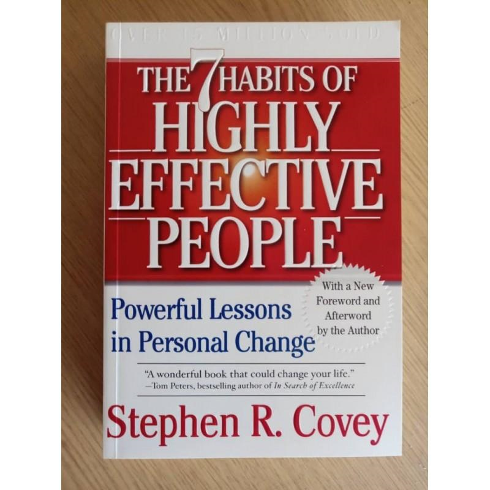
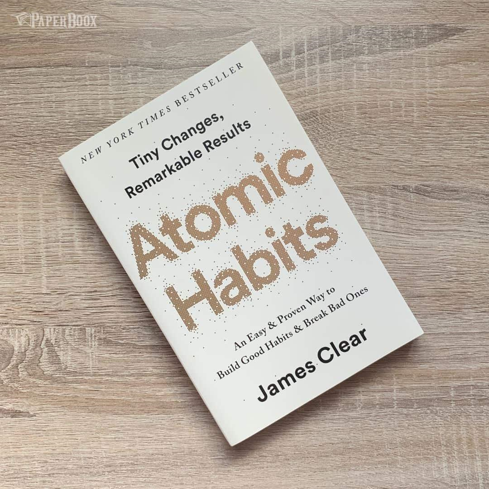

# Week 01 — Success Mindset (Mindset OS)

Part of the DevOps Micro Internship (DMI) Cohort 3 with Agentic AI

---

## Purpose (Read This First)

This week is not motivation homework.

This is you building your **Mindset OS** — the system you will use for the next 5 months (and honestly, for years).

### Expectations

* Be honest.
* Be specific.
* Be practical.
* Write like an adult professional: clear sentences, no one-liners.

You will reuse this in later weeks. So do it properly once.

---

# Assignment 1. What is something you believe to be true that most people around you would disagree with?

### Rules

* No "safe" answers.
* Must be your real belief (not copied from internet).
* Minimum 50 words.

**Hint:** What do you believe about career, money, learning, discipline, relationships, health, success, life, tech industry, etc. that most people don't agree with?

## Answer

I believe that hard work and being consistent every day are more important than talent, especially at the start of a career. Many people around me think that only talented people become successful quickly. I do not believe that. I think anyone can do well if they keep learning, work hard, and never give up.

I also believe that making mistakes is a normal part of learning. Every mistake teaches us something new. When I make a mistake while working on a project or learning a new skill, I don't stop. I try to understand my mistake and do better next time.

For me, success does not come in one day. It comes from learning every day, gaining real experience, and working hard with patience. I believe a good career is built by taking small steps every day, not by waiting for the right time or depending only on talent.

# Assignment 2. What are the top 3 objective truths you discovered through experimentation and results?

### Definition

Objective truths do not depend on opinions. They hold true regardless of how people feel.

Write each truth in this format:

**Truth:** (1 sentence)
lin
**Evidence from my life:** (2–4 es: what you tried + what happened)

---

## Truth #1

### Truth

Small daily efforts give better results than doing everything at the last minute.

### Evidence from my life

I started spending 1–2 hours every day learning DevOps instead of studying only when I had free time. After a few weeks, I understood the topics better and felt more confident while practicing.

---

## Truth #2

### Truth

Practicing a skill regularly improves it faster than only reading or watching videos.

### Evidence from my life

When I learned Linux and Docker, I created small projects and practiced commands instead of only watching tutorials. I made mistakes, fixed them, and my understanding improved much faster.
---

## Truth #3

###   Truth

Planning my day before starting work helps me complete more tasks.

### Evidence from my life

Earlier, I used to start my day without a plan and often left important work unfinished. Now I write a simple to-do list every morning, and I complete more tasks with less stress and better focus.

---

# Assignment 3. What does your 2.0 version look like?

### Instructions

Write as if a journalist is writing about you **3 to 7 years from now** (not 20 years).

**Minimum 300 words.**

### Rules

* Write in past tense, like it already happened.
* Don't use "likes to / wants to / hopes to."
* Use specifics:

  * built
  * shipped
  * led
  * published
  * earned
  * relocated
  * contributed
* Include skills proof:

  * projects
  * portfolios
  * GitHub
  * blogs
  * certifications
  * job role
  * leadership
  * community contribution
* Add 1–3 images if you can (optional but powerful).

### Publish It Publicly On Any ONE

* LinkedIn
* Medium
* WordPress
* Blogspot
* Personal blog
* Portfolio page

Include this line:

> **P.S. This post is part of the DevOps Micro Internship (DMI) with Agentic AI — Cohort 3 — by [Pravin Mishra](https://www.linkedin.com/in/pravin-mishra-aws-trainer/). My graded progress is public: https://dmi.pravinmishra.com/s/YOUR-GITHUB-USERNAME.html · Start your DevOps journey: https://dmi.pravinmishra.com/?utm_source=student&utm_medium=ps-blog&utm_campaign=cohort3**

## Your Article

 My 2.0 Version Will Look Like... 🚀

Today,I completed an assignment that encouraged me to think deeply about where I see myself over the next 5–7 years.

Writing about my future as a DevOps Engineer helped me reflect on the skills I'm building,the mindset I'm developing, and the professional I aspire to become.

I know this journey will take time, but I believe that with consistent learning, hands-on practice, and daily effort, I can turn this vision into reality.

I have published a Medium blog where I share my vision for 2030 and the roadmap I'm following to achieve it.

 Read my full Medium blog here: https://medium.com/@ashwinigarje1424/my-2-0-version-d156e7bc6c01

P.S. This post is a part of DevOps Micro Internship with Agentic AI Cohort-3 by [Pravin Mishra](https://www.linkedin.com/in/pravin-mishra-aws-trainer/). You can start your DevOps journey by joining this [Discord community](https://discord.pravinmishra.com/) ( https://discord.pravinmishra.com/ ).

### Public Link

[Paste your link here:]
(https://www.linkedin.com/posts/ashwini-garje-b55042118_my-20-version-will-look-like-todayi-share-7478126818781290497-SCoo/?utm_source=share&utm_medium=member_desktop&rcm=ACoAAB0xl_EBTu2ANEK4EKCYa3XVtmy_LCDtTkQ)

`Add your URL here`

---

# Assignment 4. Have you ever cut corners (unethical / dishonest / shortcut behavior — not necessarily illegal)? If yes, how did it make you feel?

### Important

You don't need to write the full story.

Focus on the feeling:

* guilt
* fear
* shame
* stress
* regret
* numbness
* etc.

This is about self-awareness, not judgment.

### Answer Format

**Yes / No**

If Yes:

**What emotion did you feel?** (minimum 50–100 words)

## Answer 

Once, I told my parents that I was on my way home, even though I had not left yet. I only said it because I did not want them to worry or get angry. At that moment, it felt like a small lie, but later I felt guilty because I knew I was not being honest. I also felt stressed because I was afraid they might find out the truth. After that, I realized that even a small lie can make me feel uncomfortable. Since then, I try to be more honest, even if the truth is not easy to say.

---

# Assignment 5. What are 10 non-fiction books you plan to read in the next 1 year?

### Rules

* Mention **Title + Author**
* Any language allowed
* No fiction novels

### Tip

Choose books that improve:

* mindset
* communication
* productivity
* health
* money
* career
* leadership

## Book List

1.The 5 AM Club        Author :Robin Sharma

2.The Psychology of Money  Author: Morgan Housel

3.Deep Work          Author: Cal Newport 

4.The 7 Habits of Highly Effective People   Author:Stephen R. Covey

5.Atomic Habits    Author: James Clear

6.You Can Win       Author: Shiv Khera

7.Belive in yourself      Author: Dr.Joseph Murphy

8.Poor Little Rich Slum       Author: Rashmi Bansal & Deepak Gandhi

9.Make Epic Money  Author: Ankur Warikoo

10.You Can Sell    Author:Shiv Khera

---

# Assignment 6. What are the things you will measure regularly in your life and career?

### Rules

List topics only. No need to share numbers.

### Must Include

* Learning / skill
* Output / proof
* Health / energy
* Time / focus
* Money / finance (personal or business)

### Example

* Learning hours per week
* Deep work sessions per week
* Projects shipped / documented
* Steps / workouts
* Sleep hours
* Spending tracker

## My Metrics

* DMI live session (Saturday, 10:00 AM to 5:00 PM)
* Learning hours per week (25 hours)
* Hands-on practice and assignment sessions (5–6 hours)
* daily documentation at 1 hr
* Daily revision 1-2 hr
* Sleep quality
* Exercise and physical activity morning 30 min
* Personal expense tracking

---

# Assignment 7. Brain Dump + 5-Month System Plan

## Step 1: Brain Dump (Private)

Do a brain dump of everything in your mind into a notebook.

Examples:

* Bills
* Tasks
* Worries
* Goals
* Pending messages
* Ideas
* Responsibilities

### Did You Do It?

**Yes / No**

Answer:

I wrote down everything that was on my mind, including my pending tasks, work responsibilities, DMI assignments, DevOps learning goals, family responsibilities, future career plans, and personal reminders. After writing everything down, I felt more relaxed and had a clear idea of what I needed to focus on first.

---

## Step 2: Your 5-Month Routine + Focus Blocks

Create a simple plan you can realistically follow for the next 5 months.

### Weekly Routine

Example:

* Mon–Thu: 60 min deep work
* Sat: DMI session
* Sun: Weekly review

#### My Weekly Routine

Monday-Start the week by setting one clear learning goal and do the planning for tasks.
Complete one DMI task or one DevOps topic.

Tuesday-Practice Linux, Git, Docker, AWS, or Kubernetes.Spend a few minutes revising yesterday's learning.

Wednesday-Work on DMI assignments and hands of practices in any tasks at least 2-3 times after I review it.

Thursday-Build or improve a small DevOps project.Update my notes with new learning.

Friday-Submit the all weeks assignment before Friday.
Clear any doubts and complete unfinished work.

Saturday-Attend the DMI session morning 10 AM to 5 PM.
Finish assignments while the session is still fresh in my mind.

Sunday-Review my weekly progress and note-down the my imp piont 
Plan for the next week assignments and time spend with family.

### Focus Blocks

#### When Will You Do DMI Work? (Days + Time)

Monday to Friday: 11:00 AM - 5 PM  working on learning and assignments)
Monday to Friday: 9:00 PM – 10:00 PM support meeting and revision
Saturday:  DMI live session from 10Am to 5 Am.
Sunday: planning for next week and goals 

#### How Many Sessions Per Week?

4 DMI (DevOps Micro Internship)  live sessions
mon-fri support and 1 weekly review session
Total 7 focused sessions every week.

---

### Distraction Rules

Examples:

* Phone rules
* Social media rules
* Environment setup

#### My Distraction Rules

I will start every study session with a clear goal.
My phone will stay on silent mode until I finish my planned work.
I will avoid Instagram, YouTube, and other social media during study time unless they are needed for learning.
I will keep only the required tabs open on my laptop.
I will keep a bottle of water and my notebook on my desk so I don't get up frequently.
If I feel distracted, I will take a short 5-minute break and continue instead of stopping for the day.

---

# Reflection – Week 1

### Biggest insight I got about myself this week

I realized that my focus improves when I work on one task at a time instead of trying to manage multiple things together. This week also helped me understand that I learn better through hands-on practice. I need to perform a task at least twice to understand it properly and remember it.

The DMI schedule, with live sessions on Saturday, self-study during the week, and assignment deadlines on Friday, helped me stay organized. I also realized that I can spend 5–6 hours a day learning and stay consistent when I have a clear purpose. This week helped me build confidence, consistency, and discipline.

### My biggest weakness/loop I noticed

I noticed that I sometimes feel stressed because of pending tasks. This makes it difficult for me to focus on my current work and complete it properly.

### One system I will implement from this week (exact habit + time)

I have created a routine for the next five months. From Monday to Thursday, I will spend 5–6 hours each day on focused DevOps learning. Friday will be dedicated to revision. Saturday will be for DMI live classes, assignments, and project work. Sunday will be used to review the week's progress and plan for the next week.

Every day from 7:00 PM to 11:00 PM, I will revise what I learned during the day, complete my assignments, and practice troubleshooting to strengthen my understanding.

A big thank you to the mentor, Pravin Mishra, and co-mentors, Anjana Muthunayake, Tanisha Borana, Nkechi Anna Ahanonye. I'm looking forward to learning from your experience over the coming months.

A big thank you to the mentor, Pravin Mishra, and co-mentors, Anjana Muthunayake, Tanisha Borana, Nkechi Anna Ahanonye and Anuradha Iyer. I'm looking forward to learning from your experience over the coming months.

P.S. This post is a part of DevOps Micro Internship with Agentic AI Cohort-3 by Pravin Mishra. You can start your DevOps journey by joining this Discord community ( https://lnkd.in/dCbqD9HH ).

### LinkedIn Post

[Paste your LinkedIn post link here:](https://www.linkedin.com/posts/ashwini-garje-b55042118_dmi-devops-agenticai-share-7478483038453112835-kqHz/?utm_source=share&utm_medium=member_desktop&rcm=ACoAAB0xl_EBTu2ANEK4EKCYa3XVtmy_LCDtTkQ)

`Add your URL here`

---

## 10. Proof of Work

- LinkedIn Post URL: 

(https://www.linkedin.com/posts/ashwini-garje-b55042118_dmi-devops-agenticai-share-7478483038453112835-kqHz/?utm_source=share&utm_medium=member_desktop&rcm=ACoAAB0xl_EBTu2ANEK4EKCYa3XVtmy_LCDtTkQ)

https://www.linkedin.com/posts/ashwini-garje-b55042118_my-20-version-will-look-like-todayi-completed-share-7478126818781290497-qo5L/?utm_source=share&utm_medium=member_desktop&rcm=ACoAAB0xl_EBTu2ANEK4EKCYa3XVtmy_LCDtTkQ

- Blog / Medium :  

https://medium.com/@ashwinigarje1424/my-2-0-version-d156e7bc6c01

---

## 📌 About DMI & CloudAdvisory

DevOps Micro Internship (DMI) is a project-based DevOps program run by Pravin Mishra (The CloudAdvisory) focused on real-world execution, systems thinking, and career readiness.

It helps learners build strong DevOps foundations with hands-on experience.

## 📌 Resources

- 🌐 **DMI Official Website:** https://pravinmishra.com/dmi  
- 🎓 **DevOps for Beginners (Udemy):** https://www.udemy.com/course/devops-for-beginners-docker-k8s-cloud-cicd-4-projects/  
- 🎓 **Ultimate Agentic AI DevOps with Clude Code** https://www.udemy.com/course/ultimate-agentic-ai-devops-with-claude-code/?referralCode=448389767BC96284087B
- 🎓 **DevOps with Claude Code: Terraform, EKS, ArgoCD & Helm** https://www.udemy.com/course/devops-with-claude-code-terraform-eks-argocd-helm/?referralCode=1C5B734505D65A010FA3
- ▶️ **YouTube Playlist (DMI Cohort 3):** https://www.youtube.com/playlist?list=PLFeSNDtI4Cho  
- 🔗 **Pravin Mishra (LinkedIn):** https://www.linkedin.com/in/pravin-mishra-aws-trainer/  
- 🏢 **CloudAdvisory (LinkedIn):** https://www.linkedin.com/company/thecloudadvisory/

---

*This submission is part of DevOps Micro Internship (DMI) Cohort 3 — Agentic AI Track*