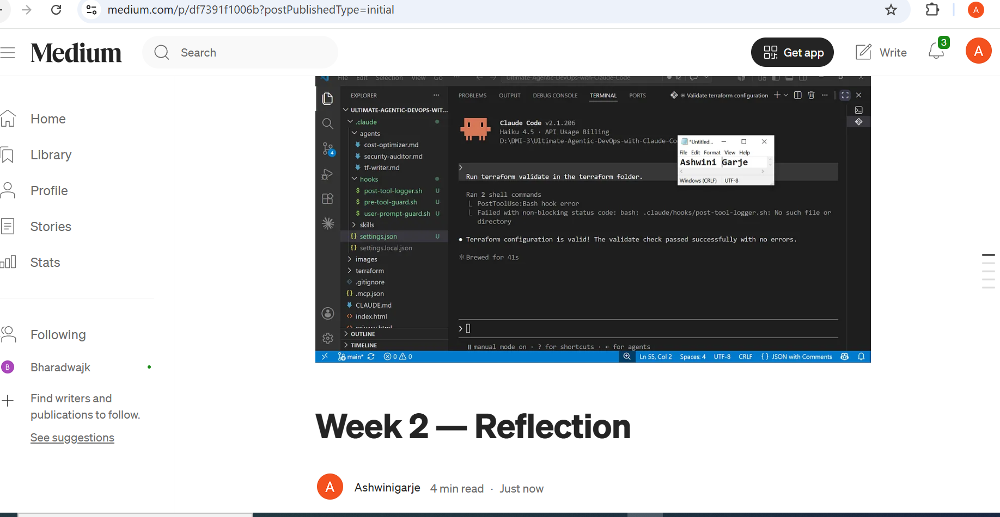
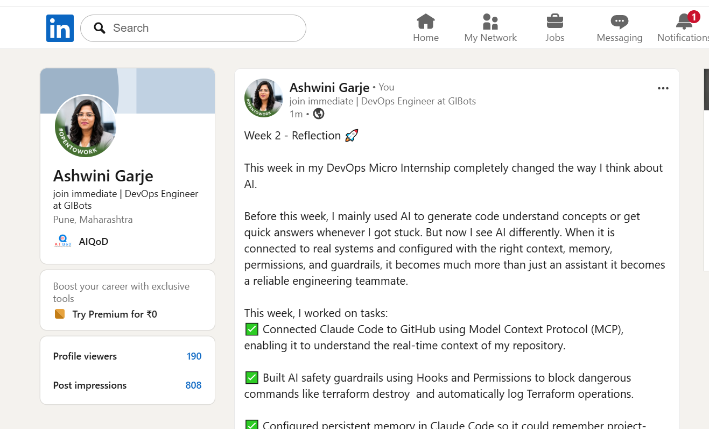
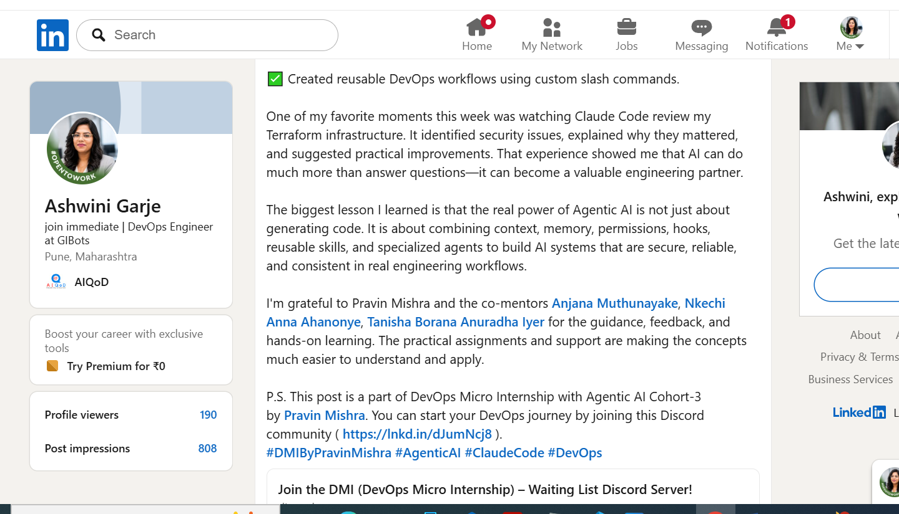

# Assignment 8 — Week 2 Reflection Blog

Part of the DevOps Micro Internship (DMI) Cohort 3 with Agentic AI

---

# Purpose

In this assignment, you will reflect on your Week 2 learning journey and write a short blog capturing your experience working with Agentic AI tools such as Claude Code, Skills, Subagents, MCP, Hooks, Permissions, and Memory.

You will also publish a LinkedIn post summarizing your learning and share both links for evaluation.

---

# Task 1 — Write Your Reflection Blog

## Goal

Write a reflection blog covering your Week 2 learning experience.

### Blog Requirements

Your blog must include:

* Title: **Reflection – Week 2**
* Minimum 300 words
* At least 2–3 topics from Week 2 (Claude Code, Skills, Subagents, MCP, Hooks, Permissions, Memory)
* Honest personal reflection (learning, challenges, mindset)
* One habit/system you plan to implement
* Your full name clearly visible

### Allowed Platforms

You can publish your blog on:

* Hashnode
* Medium
* Dev.to
* LinkedIn Article
* GitHub Markdown file
* Substack

---

### Evidence

#### Screenshot 1 — Blog published and visible




---

### Submission Field

Blog Link:https://medium.com/@ashwinigarje1424/week-2-reflection-df7391f1006b

`Add your URL here`

---

# Task 2 — Create LinkedIn Post

## Goal

Share your Week 2 learning publicly on LinkedIn.

---

### LinkedIn Post Requirements

Your post must include:

* One screenshot from any Week 2 assignment
* Short reflection (what you learned or built)
* Required P.S. line exactly as given below

---

### Required P.S. Line (Must Include Exactly)

> **P.S. This post is part of the DevOps Micro Internship (DMI) with Agentic AI — Cohort 3 — by [Pravin Mishra](https://www.linkedin.com/in/pravin-mishra-aws-trainer/). My graded progress is public: https://dmi.pravinmishra.com/s/YOUR-GITHUB-USERNAME.html · Start your DevOps journey: https://dmi.pravinmishra.com/?utm_source=student&utm_medium=ps-linkedin&utm_campaign=cohort3**

---

### Suggested Hashtags

#DMIByPravinMishra #AgenticAI #ClaudeCode #DevOps #LearningInPublic

---

### Evidence

#### Screenshot 2 — LinkedIn post published






---

### Submission Field

LinkedIn Post Content (copy-paste here):

```
Week 2 - Reflection 🚀

This week in my DevOps Micro Internship completely changed the way I think about AI.

Before this week, I mainly used AI to generate code understand concepts or get quick answers whenever I got stuck. But now I see AI differently. When it is connected to real systems and configured with the right context, memory, permissions, and guardrails, it becomes much more than just an assistant it becomes a reliable engineering teammate.

This week, I worked on tasks:
✅ Connected Claude Code to GitHub using Model Context Protocol (MCP), enabling it to understand the real-time context of my repository.

✅ Built AI safety guardrails using Hooks and Permissions to block dangerous commands like terraform destroy  and automatically log Terraform operations.

✅ Configured persistent memory in Claude Code so it could remember project-specific rules across completely new sessions.

✅ Created reusable DevOps workflows using custom slash commands.

One of my favorite moments this week was watching Claude Code review my Terraform infrastructure. It identified security issues, explained why they mattered, and suggested practical improvements. That experience showed me that AI can do much more than answer questions—it can become a valuable engineering partner.

The biggest lesson I learned is that the real power of Agentic AI is not just about generating code. It is about combining context, memory, permissions, hooks, reusable skills, and specialized agents to build AI systems that are secure, reliable, and consistent in real engineering workflows.

I'm grateful to Pravin Mishra and the co-mentors Anjana Muthunayake, Nkechi Anna Ahanonye, Tanisha Borana Anuradha Iyer for the guidance, feedback, and hands-on learning. The practical assignments and support are making the concepts much easier to understand and apply.

P.S. This post is a part of DevOps Micro Internship with Agentic AI Cohort-3 by Pravin Mishra. You can start your DevOps journey by joining this Discord community ( https://lnkd.in/dJumNcj8 ).
#DMIByPravinMishra #AgenticAI #ClaudeCode #DevOps
```

---

### LinkedIn Post Link:


`https://www.linkedin.com/posts/ashwini-garje-b55042118_join-the-dmi-devops-micro-internship-activity-7481773920661065728-n9nd?utm_source=share&utm_medium=member_desktop&rcm=ACoAAB0xl_EBTu2ANEK4EKCYa3XVtmy_LCDtTkQ`

---

# Submission Instructions

* Blog must be publicly accessible
* LinkedIn post must be visible (public or unlisted where applicable)
* All required fields must be filled
* Screenshot proofs must be added to GitHub repository
* Do not include sensitive information in blog or post

---

# Completion Checklist

* ✅  Blog written with required structure
* ✅  Blog includes at least 2–3 Week 2 topics
* ✅  Blog is publicly accessible
* ✅  LinkedIn post created
* ✅  Required P.S. line included
* ✅  LinkedIn post content copied in submission field
* ✅  Blog link added
* ✅  LinkedIn post link added
* ✅  Screenshots added to GitHub repo

---

# About DMI & CloudAdvisory

DevOps Micro Internship (DMI) is a project-based DevOps program run by Pravin Mishra (The CloudAdvisory), focused on real-world execution, systems thinking, and agentic AI workflows.

It helps learners build strong DevOps foundations through hands-on experience.

---

# Resources

* 🌐 DMI Official Website: [https://pravinmishra.com/dmi](https://pravinmishra.com/dmi)
* 🎓 DevOps for Beginners (Udemy): [https://www.udemy.com/course/devops-for-beginners-docker-k8s-cloud-cicd-4-projects/](https://www.udemy.com/course/devops-for-beginners-docker-k8s-cloud-cicd-4-projects/)
* 🎓 Agentic AI DevOps with Claude Code: [https://www.udemy.com/course/ultimate-agentic-ai-devops-with-claude-code/](https://www.udemy.com/course/ultimate-agentic-ai-devops-with-claude-code/)
* 🎓 DevOps with Claude Code: Terraform, EKS, ArgoCD & Helm: [https://www.udemy.com/course/devops-with-claude-code-terraform-eks-argocd-helm/](https://www.udemy.com/course/devops-with-claude-code-terraform-eks-argocd-helm/)
* ▶️ YouTube Playlist: [https://www.youtube.com/playlist?list=PLFeSNDtI4Cho](https://www.youtube.com/playlist?list=PLFeSNDtI4Cho)
* 🔗 Pravin Mishra (LinkedIn): [https://www.linkedin.com/in/pravin-mishra-aws-trainer/](https://www.linkedin.com/in/pravin-mishra-aws-trainer/)
* 🏢 CloudAdvisory (LinkedIn): [https://www.linkedin.com/company/thecloudadvisory/](https://www.linkedin.com/company/thecloudadvisory/)

