# Assignment 5 — Bash Script Automation Drill (OPS Checklist)

Part of the DevOps Micro Internship (DMI) Cohort 3 with Agentic AI

---

## Purpose

In this assignment, you will practice Bash scripting by building a series of small automation scripts covering environment setup, variables, arrays, loops, file conditionals, if-else logic, and functions. These scripts form the foundation of real-world Linux automation used in DevOps, cloud, and production support environments.

---

# Task 1 — Bash Environment & Workspace Setup

## Goal

Verify that Bash is available on your system and create a clean workspace for this assignment.

### Evidence

#### Screenshot 1 — Output of `echo $SHELL` and `bash --version`

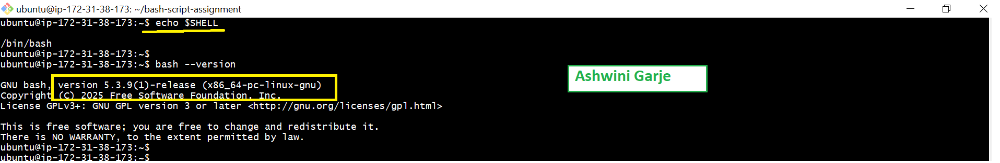

---

#### Screenshot 2 — Output of `pwd` and `ls -lah` showing the scripts directory

---

### Notes

Answer the following in your own words:

**1. What is Bash?**

Bash ( Bourne Again SHell) is a text-based command-line interpreter and scripting language used to interact with a computer's operating system.

---

**2. What is the difference between shell and Bash?**

Shell is a command-line interface that lets users interact with the operating system. There are different types of shells, such as Bash, Zsh, and Ksh.

Bash (Bourne Again Shell) is a specific type of shell. It is the default shell on many Linux systems and supports scripting, command history and auto-completion.

---

**3. Why is it important to confirm the Bash version before writing scripts?**

The checking Bash version verify your script uses features supported by that Bash version and runs without errors.

---

# Task 2 — Your First Bash Script

## Goal

Create your first Bash script, make it executable, and run it from the terminal.

### Evidence

#### Screenshot 1 — Content of `first-script.sh`

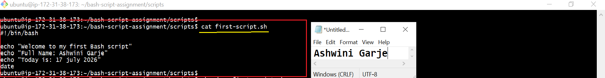

---

#### Screenshot 2 — Output of `./first-script.sh`

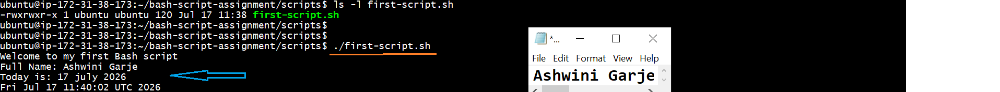

---

#### Screenshot 3 — Output of `ls -l first-script.sh` showing executable permission

.

---

**2. Why do we use `chmod +x` before running a script?**
We use chmod +x to make the script executable.It allows us to run the script directly from the terminal.

---

**3. What is the difference between running a script using `./script.sh` and `bash script.sh`?**

./script.sh is runs the script directly so it needs execute permission chmod +x and its run shell interperter.bash script.sh is runs the script with Bash so execute permission is not needed.
---

# Task 3 — Variables: User Information Script

## Goal

Use variables to store and display user-related information.

### Evidence

#### Screenshot 1 — Content of `user-info.sh`
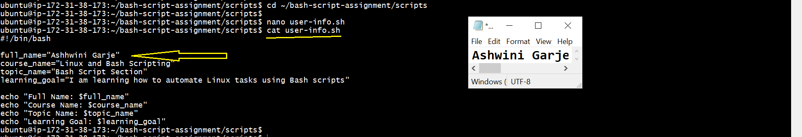

---

#### Screenshot 2 — Output of `./user-info.sh`

---

### Notes

Answer the following in your own words:

**1. What is a variable in Bash?**

A variable in Bash is name used to store information like a value or text that can be used later in the script.its read to easy update

---

**2. Why should we avoid spaces around the `=` sign when creating variables?**

We do not use spaces around the = sign because Bash will not understand it.
This helps the variable work correctly.

---

**3. How do you access the value stored inside a Bash variable?**

You can access a Bash variable by using the $ sign before the variable name.It tells Bash to show the value stored in the variable.
For ex- if name="Ashwini" use echo $name The output will be Ashwini.

---

# Task 4 — Arrays & Loops: Tools Checklist Script

## Goal

Use arrays and loops to print a checklist of tools used in Bash scripting.

### Evidence

#### Screenshot 1 — Content of `tools-checklist.sh`

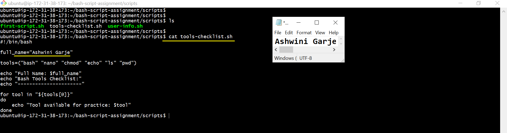

---

#### Screenshot 2 — Output of `./tools-checklist.sh`

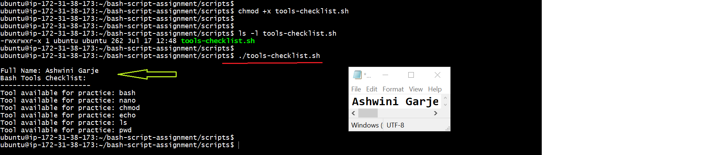

---

### Notes

Answer the following in your own words:

**1. What is an array in Bash?**

An array in Bash is a variable that can store multiple values.It keeps many items in a single variable.Each value has its own position (index).Arrays make it easy to work with a list of data.

---

**2. Why are arrays useful in scripts?**

Arrays are useful because they can store many values in one variable they make scripts easier to write and manage it.you can access each value when needed this saves time and reduces repeated code.

---

**3. What does `"${tools[@]}"` mean?**

A"${tools[@]}" means all the values stored in the tools array it accesses every item in the array one by one.It is commonly used in loops or commands This helps process all array values easily.

---

**4. What is the purpose of the `for` loop in this script?**

The for loop is used to go through each item one by one it repeats the same task for every value.
This saves time and avoids writing the same code again.
It makes the script simple and easy to manage.

---

# Task 5 — Loops: Number Counter Script

## Goal

Use loops to repeat a task multiple times.

### Evidence

#### Screenshot 1 — Content of `counter.sh`

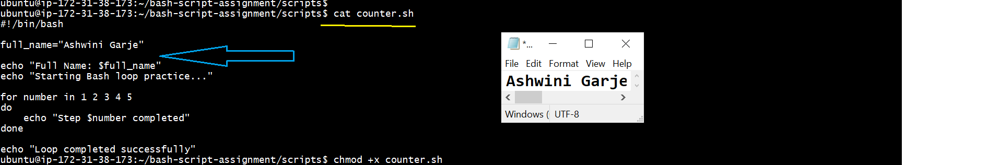

---

#### Screenshot 2 — Output of `./counter.sh`

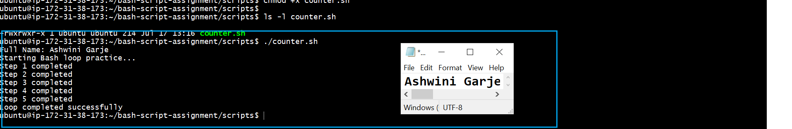

---

### Notes

Answer the following in your own words:

**1. What is a loop?**

A loop is used to repeat the same task again and again in a script it runs a block of code until all the required work is done.Loops help save time and reduce repeated code They make scripts easier to write and understand.
---

**2. Why do we use loops in Bash scripting?**

We use loops in Bash scripting to repeat the same task automatically they help save time and reduce repeated code.Loops make scripts shorter and easier to manage.

---

**3. How many times did the loop run in your script?**

The loop ran 5 times in the script it repeated the same task for each value from 1 to 5.

---

**4. What would you change if you wanted the loop to run 10 times?**

To run the loop 10 times, change the range from 1..5 to 1..10. this will make the loop repeat the task 10 times.

---

# Task 6 — Files & Conditionals: File Validation Script

## Goal

Use file checks and conditionals to verify whether files and directories exist.

### Evidence

#### Screenshot 1 — Output of `ls -lah ../test-folder`

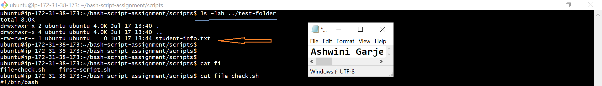

---

#### Screenshot 2 — Content of `file-check.sh`

---

#### Screenshot 3 — Output of `./file-check.sh`

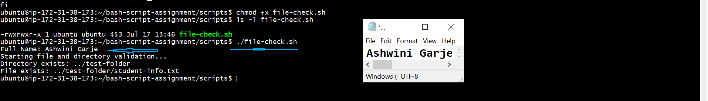

---

### Notes

Answer the following in your own words:

**1. What does `-d` check in Bash?**

The -d means directory checks if a directory exists.It returns true if the directory is found and false if it is not.

---

**2. What does `-f` check in Bash?**

The -f file and directory paths are stored in variables to make the script easier to read.It also makes it easy to change the path without editing the whole script.

---

**3. Why should file and directory paths be stored in variables?**

File and directory paths should be stored in variables because they make the script simple and easy to read if the path changes, you only need to update the variable instead of changing it everywhere in the script.

---

**4. What happens if the file does not exist?**

If the file does not exist, Bash returns false for the check the script can then show a message or take another action.

---

# Task 7 — Conditionals: Pass or Retry Script

## Goal

Use if-else conditionals to make decisions based on a variable value.

### Evidence

#### Screenshot 1 — Content of `score-check.sh` with `score=85`

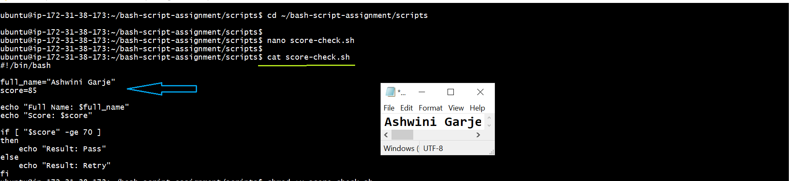

---

#### Screenshot 2 — Output showing `Result: Pass`

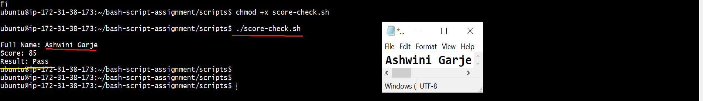

---

#### Screenshot 3 — Content of `score-check.sh` with `score=55`

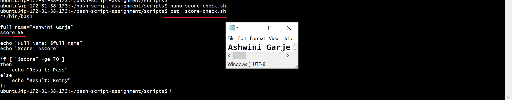

---

#### Screenshot 4 — Output showing `Result: Retry`

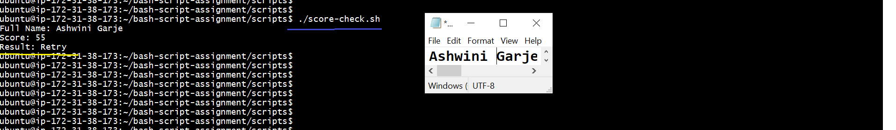

---

### Notes

Answer the following in your own words:

**1. What is the purpose of if-else in Bash?**

The if-else statement is used to make decisions in a Bash script it runs one block of code if the condition is true and another if it is false.
---

**2. What does `-ge` mean?**

-ge means greater than or equal to when compare numbers in Bash it checks if one number is bigger than or the same as another number.

---

**3. Why should conditions be tested with different values?**

Conditions should be tested with different values to make sure the script works correctly.
It helps us find errors before using the script This makes the script safe and reliable.
---

**4. How can conditionals help in automation scripts?**

Conditionals help to script make decisions automatically .run different actions based on the result of a condition this makes automation faster and reduces manual work.

---

# Task 8 — Functions: Final Bash Automation Script

## Goal

Create a final Bash script using functions to organize reusable code.

### Evidence

#### Screenshot 1 — Content of `final-automation.sh`

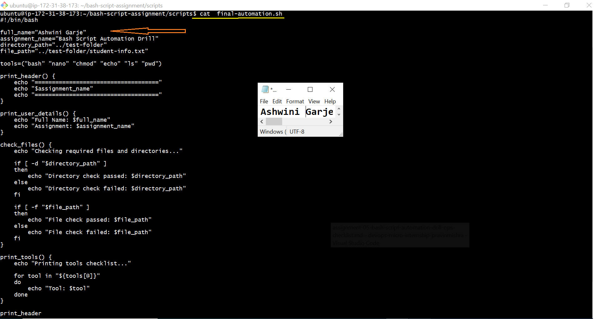

---

#### Screenshot 2 — Output of `./final-automation.sh`

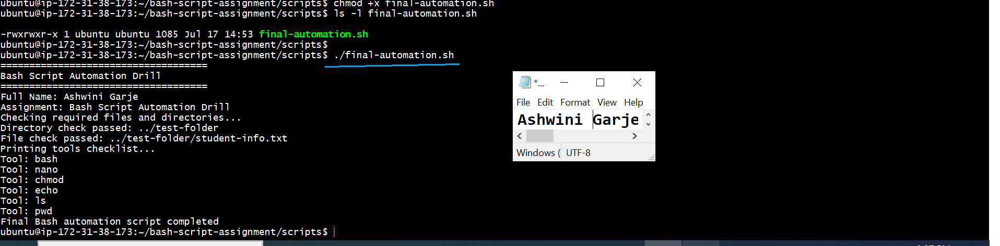

---

#### Screenshot 3 — Output of `ls -lah` showing all created scripts

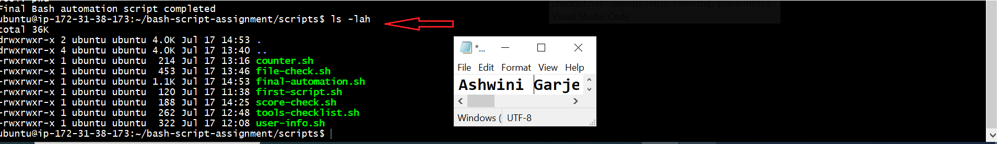

---

### Notes

Answer the following in your own words:

**1. What is a function in Bash?**

A function in Bash is a block of code that performs a specific task can call it whenever you need it in the script this saves time and avoids writing the same code again.

---

**2. Why are functions useful in scripts?**

Functions are scripts because they enable code reusability, modularity, and easier maintenance. Instead of copying and pasting the same logic you write a function once and call it with different data, allowing you to update the code in a single place if changes are needed.

---

**3. Which functions did you create in this script?**

In this script, I created four functions: print_header(), print_user_details(), check_files(), and print_tools().Each function has its own job, which makes the script clean, easy to read, and simple to manage.

---

**4. How does this final script combine variables, arrays, loops, conditionals, files, and functions?**

The final script uses variables to store values and arrays to store multiple items.
It uses loops to repeat tasks and conditionals to make decisions.It also checks files and uses functions to organize the code, making the script simple and easy to manage.

---

# LinkedIn Post (Required)

## Evidence

#### LinkedIn Post URL

Paste your LinkedIn post URL here:

`https://www.linkedin.com/posts/ashwini-garje-b55042118_this-bash-scripting-assignment-helped-me-ugcPost-7484234824275206145-od0P/?utm_source=share&utm_medium=member_desktop&rcm=ACoAAB0xl_EBTu2ANEK4EKCYa3XVtmy_LCDtTkQ`

---

#### Screenshot — Published LinkedIn post

---

# Submission Instructions

- Add all required screenshots in your submission
- Full name must be visible in required screenshots
- All script files must be created and run successfully
- Required notes must be answered clearly for every task
- Do not expose sensitive information (keys, passwords, credentials)

---

# Completion Checklist

- ✅ Task 1: Environment setup verified, workspace created (Screenshots 1–2, Notes answered)
- ✅ Task 2: First script created, executed, permissions verified (Screenshots 1–3, Notes answered)
- ✅ Task 3: Variables script created and run (Screenshots 1–2, Notes answered)
- ✅ Task 4: Arrays and loops script created and run (Screenshots 1–2, Notes answered)
- ✅ Task 5: Counter loop script created and run (Screenshots 1–2, Notes answered)
- ✅ Task 6: File validation script created and run (Screenshots 1–3, Notes answered)
- ✅ Task 7: Pass/Retry conditional script tested with both values (Screenshots 1–4, Notes answered)
- ✅ Task 8: Final automation script created and run (Screenshots 1–3, Notes answered)
- ✅ All scripts run without errors
- ✅ Full Name visible in all required screenshots
- ✅ LinkedIn post published and URL submitted
- ✅ No sensitive data exposed

---

## 📌 About DMI & CloudAdvisory

DevOps Micro Internship (DMI) is a project-based DevOps program run by Pravin Mishra (The CloudAdvisory) focused on real-world execution, systems thinking, and career readiness.

It helps learners build strong DevOps foundations with hands-on experience.

---

## 📌 Resources

- 🌐 DMI Official Website: https://pravinmishra.com/dmi  
- 🎓 DevOps for Beginners (Udemy): https://www.udemy.com/course/devops-for-beginners-docker-k8s-cloud-cicd-4-projects/  
- 🎓 Agentic AI DevOps with Claude Code: https://www.udemy.com/course/ultimate-agentic-ai-devops-with-claude-code/  
- 🎓 DevOps with Claude Code: Terraform, EKS, ArgoCD & Helm: https://www.udemy.com/course/devops-with-claude-code-terraform-eks-argocd-helm/  
- ▶️ YouTube Playlist: https://www.youtube.com/playlist?list=PLFeSNDtI4Cho  
- 🔗 Pravin Mishra (LinkedIn): https://www.linkedin.com/in/pravin-mishra-aws-trainer/  
- 🏢 CloudAdvisory (LinkedIn): https://www.linkedin.com/company/thecloudadvisory/

---

*This submission is part of DevOps Micro Internship (DMI) Cohort 3 — Agentic AI Track.*