# Assignment 6 — Build an AI-Assisted Linux Health Check (AI-Assisted Linux Incident Triage)

Part of the DevOps Micro Internship (DMI) Cohort 3 with Agentic AI

---

## Purpose

In this assignment, you will build a read-only Bash triage script that checks the health of your Ubuntu server and Nginx application, connect it to Claude Code as a reusable `/linux-triage` skill, simulate a controlled Nginx incident, use the skill to gather and analyze evidence, recover the service manually, and verify recovery. The workflow follows the Agentic Loop: Gather → Analyze → Human Act → Verify.

---

# Task 1 — Confirm the Healthy Baseline and Create the Workspace

## Goal

Confirm that Nginx and the React application are healthy before building the automation.

### Evidence

#### Screenshot 1 — Output of `systemctl is-active nginx`, `ss -ltn | grep ':80'`, and `curl -I http://localhost`

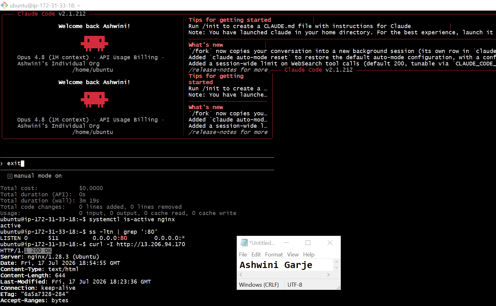

---

#### Screenshot 2 — Output of `pwd` and `find . -maxdepth 4 -type d | sort` showing the workspace folder structure

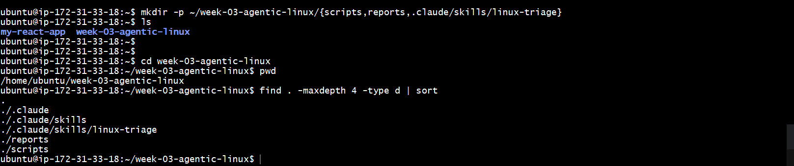

---

### Notes

Answer the following in your own words:

**1. What proves that Nginx is running?**

When I run command systemctl is-active nginx, it returns active. This confirms that Nginx is running properly.

---

**2. What proves that the server is listening for HTTP traffic?**

The output of ss -ltn | grep ':80' shows that port 80 is listening. This means the server is running and ready to accept HTTP requests from users.

---

**3. Why must you capture a healthy baseline before simulating an incident?**

A healthy baseline shows how the server works normally before an incident. It helps compare the system before and after the issue, making it easier to identify the problem and confirm that the fix worked.

---

# Task 2 — Create Project Context and Safety Rules in CLAUDE.md

## Goal

Tell Claude exactly what this project does and what it is not allowed to do.

### Evidence

#### Screenshot 3 — CLAUDE.md open in VS Code showing all four sections (Project Overview, Incident Workflow, Safety Rules, Output Rules)

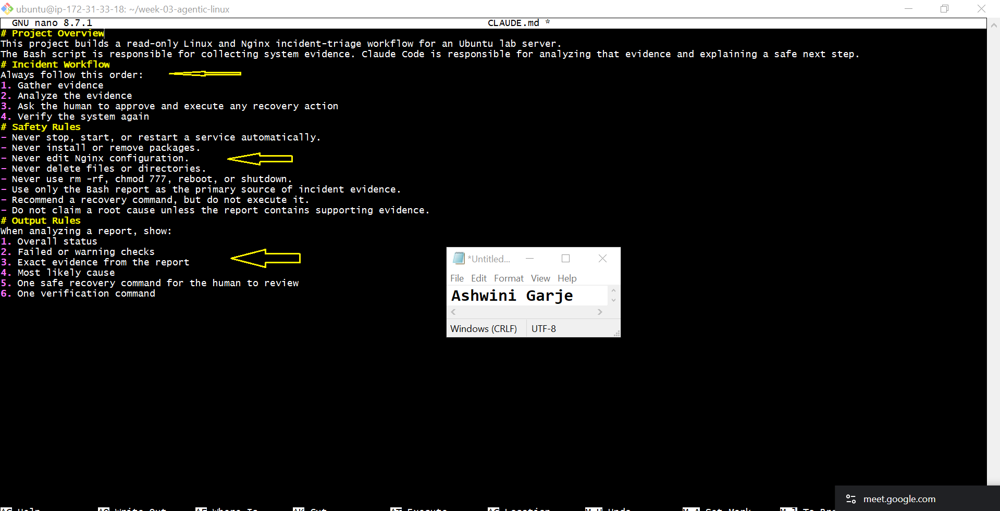

---

### Notes

Answer the following in your own words:

**1. Why should Claude receive project-specific operational rules?**

Claude should receive project-specific operational rules so it understands the project requirements, follows the correct procedures and avoids unnecessary or incorrect actions. This helps provide accurate and consistent responses during troubleshooting.

---

**2. Why is the human required to execute the recovery command?**

The human must review the evidence and confirm that the recovery command is safe before running it. Claude can recommend the command, but it should not make changes to the server on its own.

---

**3. Which rule prevents Claude from making an unsupported diagnosis?**

The evidence-first rule prevents Claude from making unsupported diagnoses.It only allows conclusions based on available evidence, not guesses.

---

# Task 3 — Use Agentic AI to Plan Before Writing the Script

## Goal

Use Claude Code to inspect the environment and produce a read-only plan before creating any Bash code.

### Evidence

#### Screenshot 4 — Claude Code showing the five-check plan and read-only inspection results

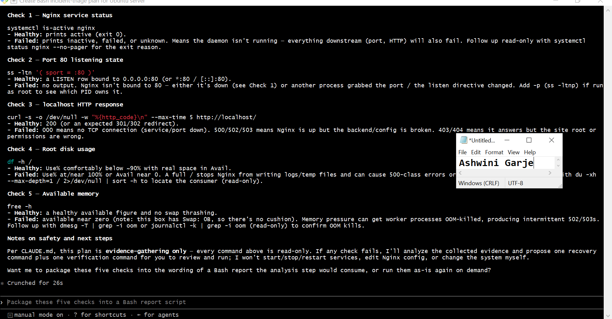

---

### Notes

Answer the following in your own words:

**1. Which part of this task represents the Gather phase?**

The read-only inspection of the Ubuntu server is the Gather phase. Claude collects information about Nginx, port 80, HTTP response, disk usage, and memory without making changes.

---

**2. Did Claude follow the instruction not to create files? How did you verify this?**

Yes, Claude followed the instruction and only performed read-only checks. I verified this by listing the files in the workspace and confirming that no Bash script or other new file was created. 

---

**3. Why is planning before coding useful in DevOps automation?**

Planning helps me decide what the script should check and what each result means before writing the code. It also helps me identify missing or unsafe steps early, instead of finding them after the script has already been created. 

---

# Task 4 — Build the Linux Triage Bash Script

## Goal

Create one Bash script that gathers consistent Linux and Nginx health evidence.

### Evidence

#### Screenshot 5 — Top section of `linux-triage.sh` showing variables, thresholds, and the checks array

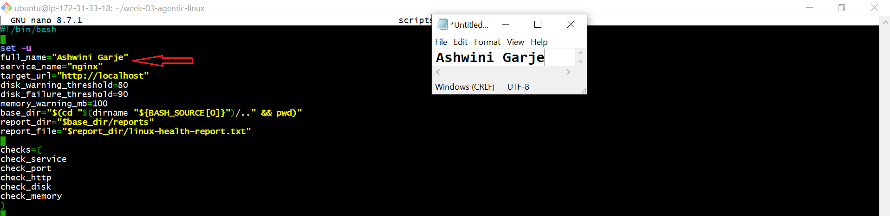

---

#### Screenshot 6 — Middle section showing check functions and conditionals

.

---

#### Screenshot 7 — Bottom section showing the loop, summary function, and exit behavior

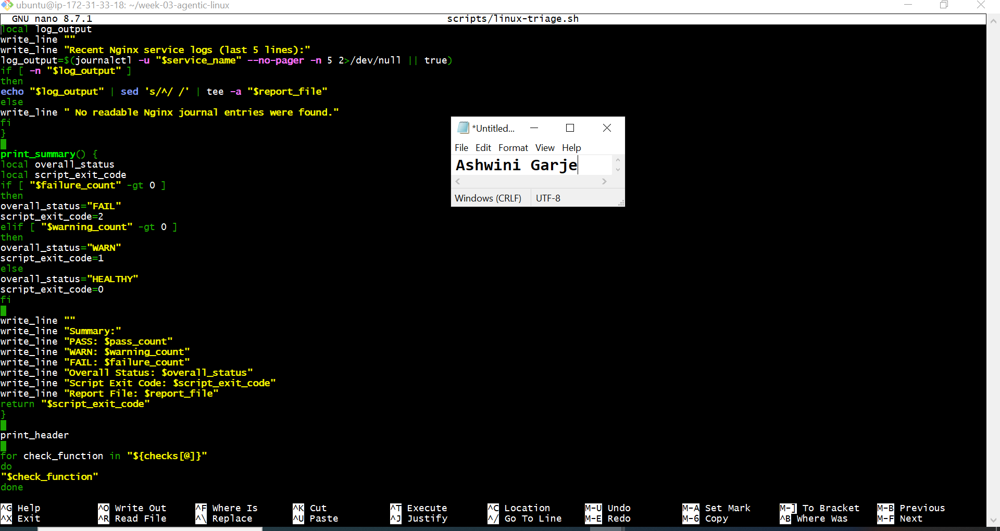

---

#### Screenshot 8 — Output of `bash -n scripts/linux-triage.sh` (no syntax errors) and `ls -l scripts/linux-triage.sh` showing executable permission

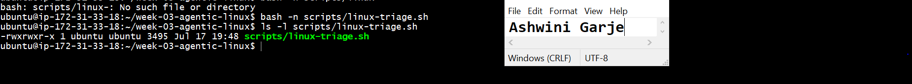

---

### Notes

Answer the following in your own words:

**1. What is stored in the checks array?**

The checks array stores the list of system checks the script will perform. It helps organize and run each check one by one.

---

**2. How does the `for` loop use that array?**

The for loop reads each function name from the array and runs the functions one at a time. 
This allows the script to complete all five health checks in the given order. 

---

**3. Why are the health checks separated into functions?**
Each function performs one specific check. This makes the script easier to read, update, and troubleshoot without affecting other parts.

---

**4. What is the purpose of `$(...)` in this script?**

   $(...) is used for command substitution. It runs a command and stores its output in a variable or uses it in the script.

---

**5. Why does the script use different exit codes for HEALTHY, WARN, and FAIL?**

The exit code shows the final health status of the Ubuntu server after all checks are complete. It helps users and automation tools quickly understand the result without reading the full report. An exit code of 0 means healthy, 1 means warning, 2 means one or more checks failed.

---

# Task 5 — Run and Understand the Healthy-State Report

## Goal

Run the Bash script against the healthy server and verify that it creates a report.

### Evidence

#### Screenshot 9 — Output of `./scripts/linux-triage.sh` showing your Full Name and all five check results

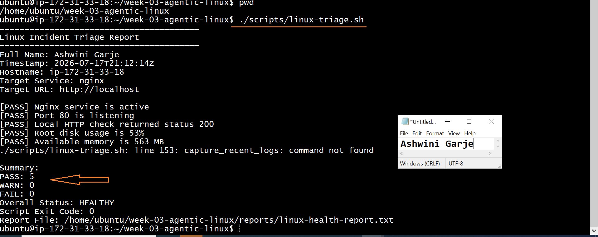

---

#### Screenshot 10 — Output showing the captured exit code and final summary

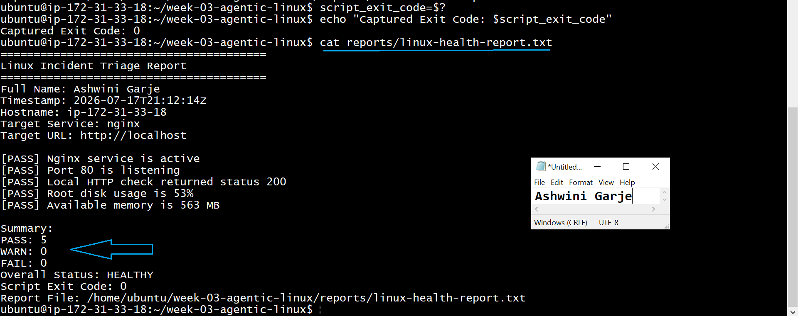

---

### Notes

Answer the following in your own words:

**1. What is the overall status of your healthy baseline?**

The overall status of my healthy baseline is HEALTHY. All system checks passed successfully.
---

**2. Which exact Linux evidence proves the application is serving traffic?**

The report shows [PASS] Port 80 is listening and [PASS] Local HTTP check returned status 200. 
Port 80 listening means the server is accepting HTTP requests, and HTTP 200 confirms the application is serving traffic successfully through Nginx.

---

**3. Did your script return exit code 0 or 1? Explain why.**

My script returned exit code 0 because all five health checks passed. Nginx was active, port 80 was listening, the application returned HTTP 200, and the disk and memory values were within the healthy limits.

---

**4. What is the difference between a warning and a failure in this script?**

A warning means the system is working, but there is a small problem that should be fixed soon. A failure means an important check did not pass, and the service may not work correctly. A warning needs attention, but a failure needs immediate fixing.

---

# Task 6 — Create and Run the /linux-triage Skill

## Goal

Turn the Bash script into a reusable, manually invoked Agentic AI workflow.

### Evidence

#### Screenshot 11 — `SKILL.md` showing the frontmatter, allowed tool restrictions, and safety rules

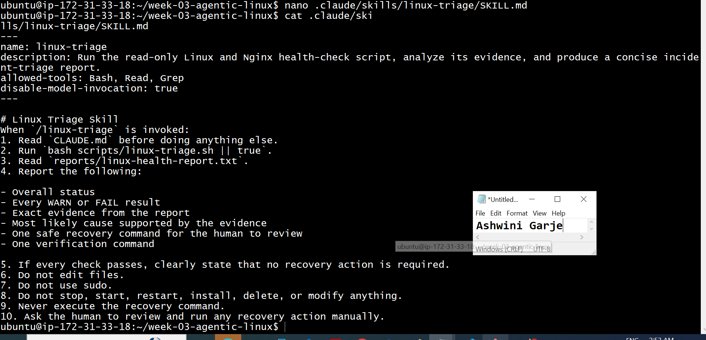

---

#### Screenshot 12 — `/linux-triage` output for the healthy server

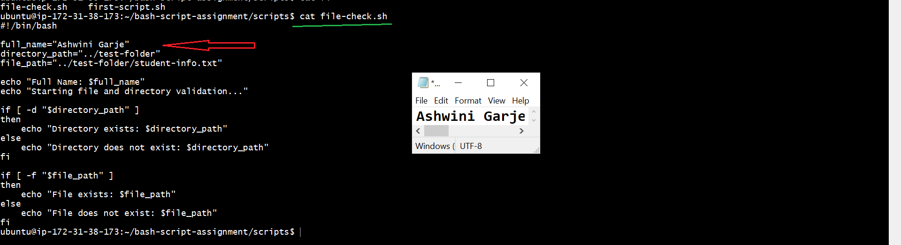

---

### Notes

Answer the following in your own words:

**1. Why does this skill have Bash, Read, and Grep, but not Write?**

This skill has Bash, Read, and Grep because it only checks and collects information. It does not have Write permission because it should not make changes to the server.
---

**2. Why is `disable-model-invocation: true` useful for this skill?**

disable-model-invocation: true makes sure the skill only follows the defined steps. It prevents the model from adding extra actions or making unexpected changes.

---

**3. What part is performed by Bash, and what part is performed by Claude?**

Bash runs the Linux commands and collects the system information. Claude reads the results, explains them, and helps identify the problem.
---

**4. Why is this better than asking Claude "Is my server healthy?" without giving it evidence?**
This is better because Claude checks real system information. It gives the correct answer based on evidence, not guesses.

---

# Task 7 — Simulate an Nginx Incident and Let the Skill Diagnose It

## Goal

Create a controlled service failure, gather evidence through Bash, and let Claude analyze the evidence without taking recovery action.

### Evidence

#### Screenshot 13 — Output showing Nginx is inactive and the HTTP request fails

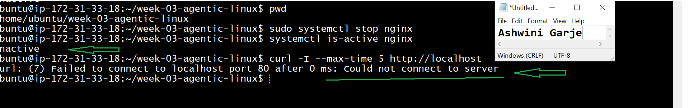

---

#### Screenshot 14 — `/linux-triage` output showing failed evidence, most likely cause, and a suggested recovery command

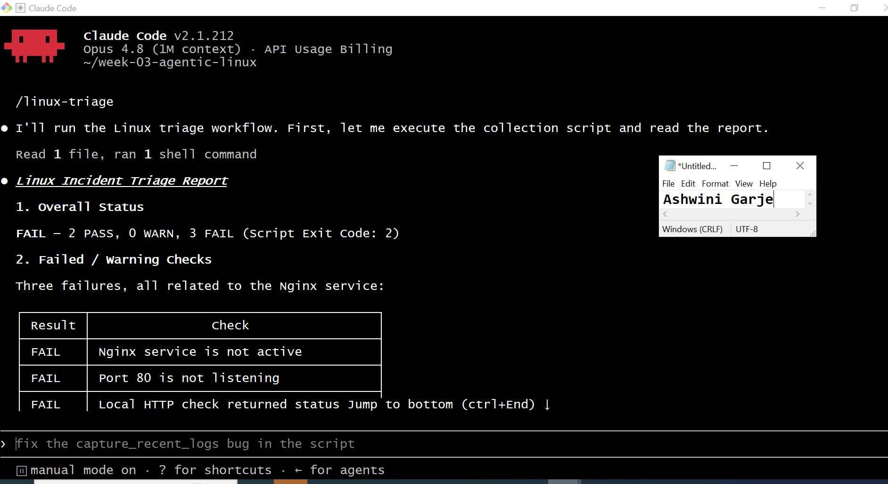

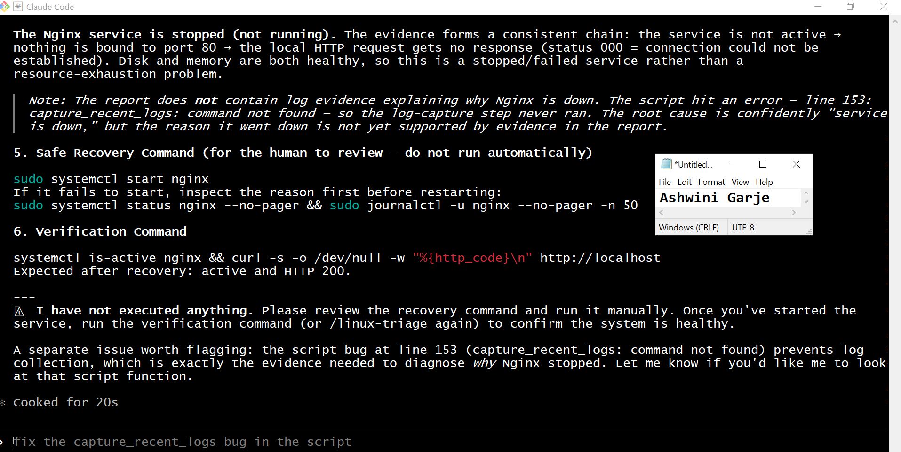

---

#### Screenshot 15 — `incident-failure-report.txt` showing the failed checks and your Full Name

A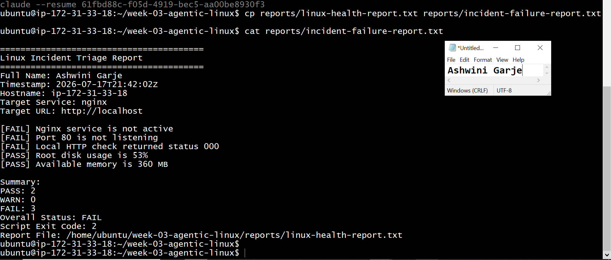

---

### Notes

Answer the following in your own words:

**1. Which three checks failed?**

Add your answer here.

---

**2. What evidence supports the conclusion that Nginx is unavailable?**

Add your answer here.

---

**3. Did Claude execute the recovery command? Why is that important?**

Add your answer here.

---

**4. Which phase of the Agentic Loop is represented by the Bash report?**

Add your answer here.

---

**5. Which phase is represented by Claude's explanation?**

Add your answer here.

---

# Task 8 — Recover Manually, Verify Again, and Write the Incident Summary

## Goal

Recover the service as the human operator and prove that the system is healthy again.

### Evidence

#### Screenshot 16 — Output showing Nginx is active and `curl -I http://localhost` returns 200 OK
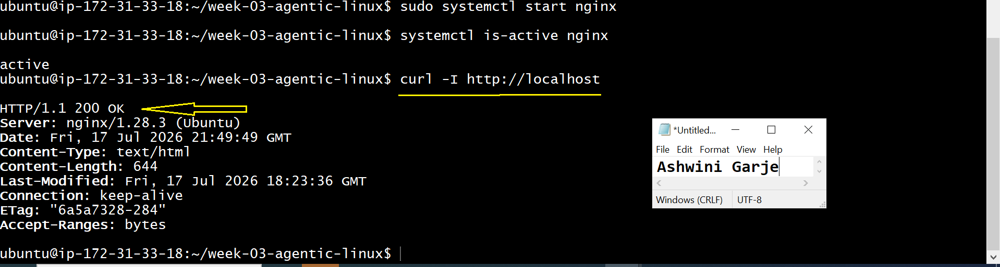

---

#### Screenshot 17 — Second `/linux-triage` output showing successful recovery with no FAIL results

Add 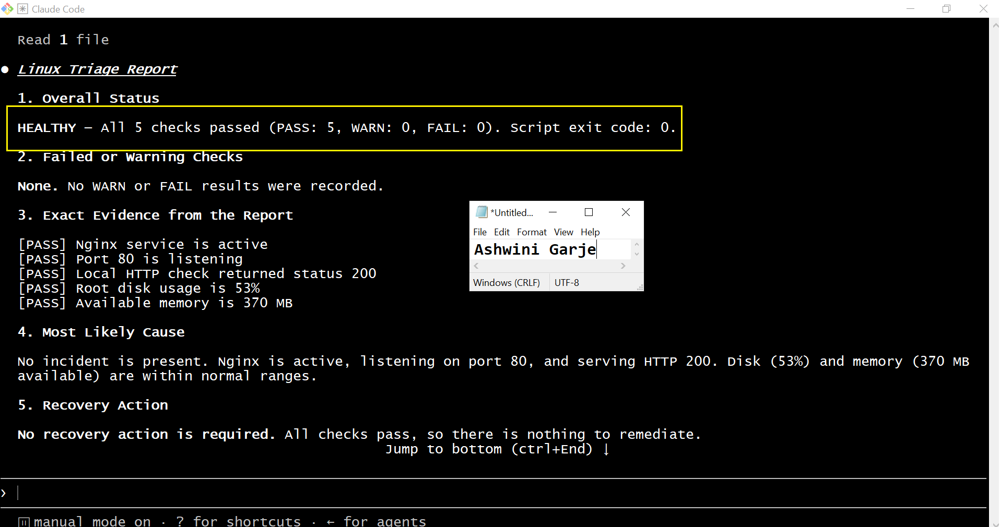
 

---

#### Screenshot 18 — Output of `ls -lah reports` showing both `incident-failure-report.txt` and `recovery-report.txt`

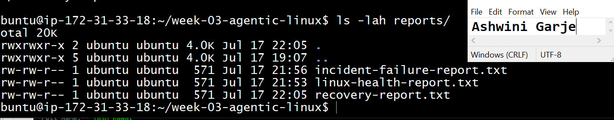

---

#### Screenshot 19 — `incident-summary.md` showing all required sections and your Full Name

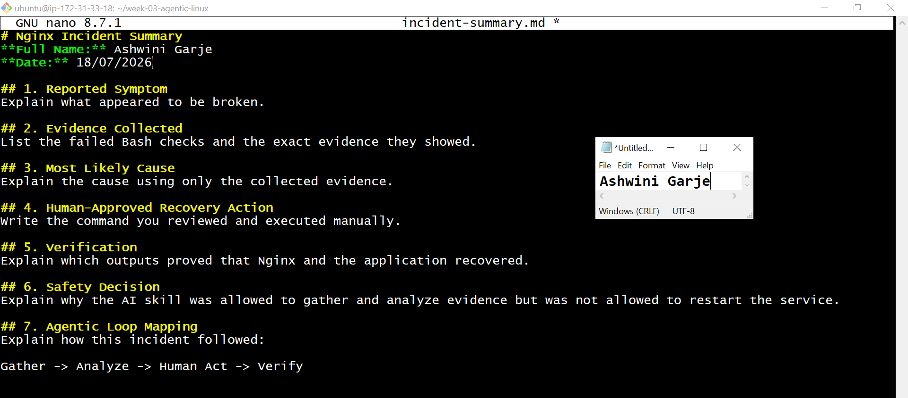

---

### Notes

Answer the following in your own words:

**1. What action did you execute manually?**

I manually exected started the Nginx service using sudo systemctl start nginx. also run nginx -t for check the nginx is running or not.

---

**2. What evidence proves that the service recovered?**

The systemctl is-active nginx command returned active and the local HTTP request returned HTTP/1.1 200 OK. The second /linux-triage run also showed that the service, port, and HTTP checks passed. 

---

**3. Why is the second triage run necessary?**

Starting Nginx does not automatically prove that the complete application is healthy. The second triage run checks the service, port, HTTP response, disk, and memory again to confirm that the server returned to a healthy state.

---

**4. What could go wrong if an AI agent automatically restarted every failed service?**

A failed service may have a configuration problem, resource problem, dependency failure, or another serious cause. Automatically restarting every service could hide the real problem, create a restart loop, or make the incident worse. The evidence should be reviewed before taking action.

---

**5. In one sentence, explain the difference between using AI as a chatbot and using AI in this agentic workflow.**

A chatbot only answers questions. An agentic AI follows steps and uses real system information to help solve problems.

---

# Incident Summary

Fill in all seven sections below in your own words.

**Full Name:** Ashwini Garje

**Date:** 18/07/2026

---

**1. Reported Symptom**

The website was not loading because the Nginx service was not running.

---

**2. Evidence Collected**

The evidence showed that the Nginx service was stopped, port 80 was not listening, and the website did not return an HTTP 200 response.

---

**3. Most Likely Cause**

The most likely cause was that the Nginx service had stopped, so the website was not unavailable.

---

**4. Human-Approved Recovery Action**

I reviewing the evidence, I manually ran sudo systemctl start nginx to start the Nginx service and service is active.

---

**5. Verification**

I verified  the recovery by checking that Nginx was active, curl -I http://localhost returned 200 OK, and all health checks passed.

---

**6. Safety Decision**

The recovery action was safe because it was reviewed before execution. The evidence confirmed that starting the Nginx service was the correct action.

---

**7. Agentic Loop Mapping**

Gather: Collected system information.Analyze: Identified that Nginx was stopped.Act: I manually started the Nginx service using sudo service start nginax
Verify: Confirmed the server was healthy with HTTP 200 OK and and application is running.

---

# LinkedIn Post (Required)

## Evidence

#### LinkedIn Post URL

Paste your LinkedIn post URL here:
<<<<<<< HEAD:week-03-linux-for-devops/assignment-06-ai-assisted-linux-health-check.md
https://www.linkedin.com/posts/ashwini-garje-b55042118_this-week-i-worked-on-building-an-ai-assisted-ugcPost-7484287445879087104-WA6U/?utm_source=share&utm_medium=member_desktop&rcm=ACoAAB0xl_EBTu2ANEK4EKCYa3XVtmy_LCDtTkQ
=======

`Add your URL here`

---
>>>>>>> upstream/main:week-03-linux-and-bash-for-devops/assignment-06-ai-assisted-linux-health-check.md

#### Screenshot — Published LinkedIn post
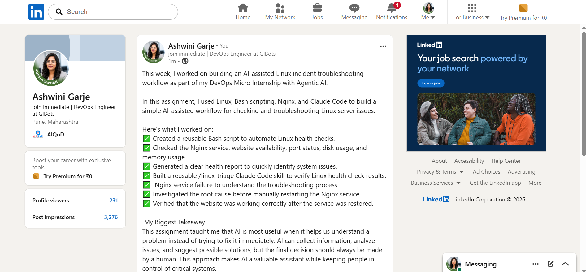

---

# GitHub Repository URL

Paste the URL of your GitHub folder or repository containing the assignment files here:

<<<<<<< HEAD:week-03-linux-for-devops/assignment-06-ai-assisted-linux-health-check.md
https://github.com/ashwinigarje/devops-micro-internship-pravinmishra/blob/main/week-03-linux-for-devops/assignment-06-ai-assisted-linux-health-check.md
=======
`Add your URL here`
>>>>>>> upstream/main:week-03-linux-and-bash-for-devops/assignment-06-ai-assisted-linux-health-check.md

---

# Submission Instructions

- Add all required screenshots in your submission
- Full Name must be visible in required screenshots and the Bash report
- All written answers must be in your own words
- Do not expose sensitive information (keys, passwords, AWS account IDs, tokens)
- GitHub URL must be included in this document

---

# Completion Checklist

- ✅ Task 1: Healthy baseline confirmed, workspace created (Screenshots 1–2, Notes answered)
- ✅ Task 2: CLAUDE.md created with all four sections (Screenshot 3, Notes answered)
- ✅ Task 3: Five-check plan produced by Claude using read-only tools (Screenshot 4, Notes answered)
- ✅ Task 4: `linux-triage.sh` created, syntax validated, executable permission set (Screenshots 5–8, Notes answered)
- ✅ Task 5: Healthy-state report generated with no FAIL result (Screenshots 9–10, Notes answered)
- ✅ Task 6: `/linux-triage` skill created and run successfully on healthy server (Screenshots 11–12, Notes answered)
- ✅ Task 7: Nginx incident simulated, failed evidence captured, Claude did not execute recovery (Screenshots 13–15, Notes answered)
- ✅ Task 8: Nginx recovered manually, recovery verified, reports saved, incident summary complete (Screenshots 16–19, Notes answered)
- ✅ Incident summary contains all seven required sections
- ✅ LinkedIn post published and URL submitted
- ✅ Full Name visible in all required screenshots and the Bash report
- ✅ Skill does not have Write permission
- ✅ Skill did not execute any recovery commands
- ✅ No sensitive data exposed

---

## 📌 About DMI & CloudAdvisory

DevOps Micro Internship (DMI) is a project-based DevOps program run by Pravin Mishra (The CloudAdvisory) focused on real-world execution, systems thinking, and career readiness.

It helps learners build strong DevOps foundations with hands-on experience.

---

## 📌 Resources

- 🌐 DMI Official Website: https://pravinmishra.com/dmi  
- 🎓 DevOps for Beginners (Udemy): https://www.udemy.com/course/devops-for-beginners-docker-k8s-cloud-cicd-4-projects/  
- 🎓 Agentic AI DevOps with Claude Code: https://www.udemy.com/course/ultimate-agentic-ai-devops-with-claude-code/  
- 🎓 DevOps with Claude Code: Terraform, EKS, ArgoCD & Helm: https://www.udemy.com/course/devops-with-claude-code-terraform-eks-argocd-helm/  
- ▶️ YouTube Playlist: https://www.youtube.com/playlist?list=PLFeSNDtI4Cho  
- 🔗 Pravin Mishra (LinkedIn): https://www.linkedin.com/in/pravin-mishra-aws-trainer/  
- 🏢 CloudAdvisory (LinkedIn): https://www.linkedin.com/company/thecloudadvisory/

---

*This submission is part of DevOps Micro Internship (DMI) Cohort 3 — Agentic AI Track.*