# Assignment 3 — Production Maintenance Drill (OPS Checklist)

Part of the DevOps Micro Internship (DMI) Cohort 3 with Agentic AI

---

## Purpose

In this assignment, you will treat your already deployed React application (on Ubuntu VM with Nginx) as a live production system. You will perform structured operational checks covering network validation, service health, log analysis, resource monitoring, configuration verification, and incident simulation with recovery — mirroring real on-call DevOps responsibilities.

---

# Task 1 — Server Access & Networking Validation

## Goal

Verify that the deployed React application is reachable from the browser and confirm basic network connectivity of the Ubuntu VM.

### Evidence

#### Screenshot 1 — Browser showing the React app with your Full Name visible on the UI

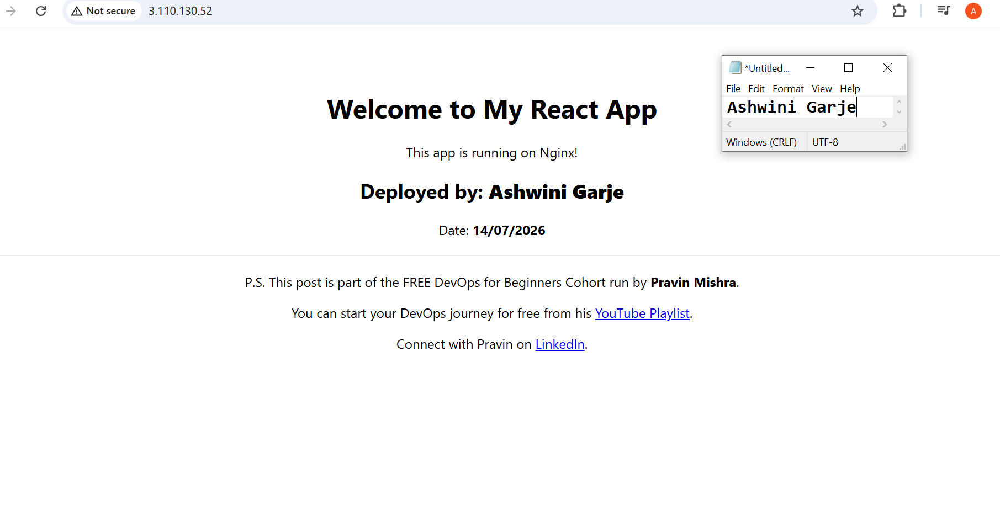

---

#### Screenshot 2 — Output of `ip a`
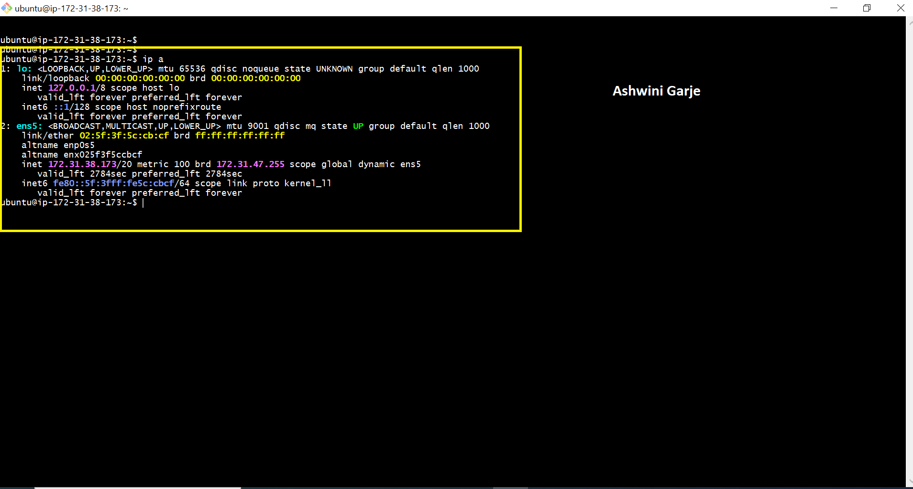

---

#### Screenshot 3 — Output of `sudo ss -tulpen`

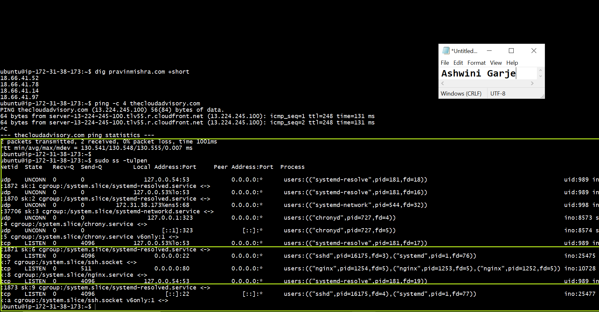

---

#### Screenshot 4 — Output of `sudo ufw status`

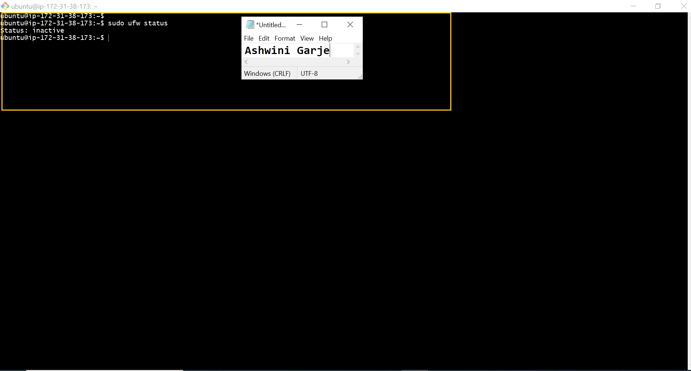

---

### Notes

Answer the following in your own words:

**1. What proves Nginx is listening on 0.0.0.0:80?**

The sudo ss -tuln  enter this command proves that Nginx is listening on 0.0.0.0:80. The output shows LISTEN 0.0.0.0:80 which means Nginx is accepting HTTP connections on port 80 from all network interfaces.
ex-tcp LISTEN  0 511  0.0.0.0:80  0.0.0.0:*  users:(("nginx",pid=1254,fd=5),("nginx",pid=1253,fd=5),("nginx" pid=1252,f
---

**2. What proves SSH is active on port 22?**
The sudo ss -tuln enter this command shows LISTEN on port 22 proving that the SSH service is active and accepting incoming connections.The SSH service (sshd) is running and ready to accept remote
ex- tcp  LISTEN  0 4096  0.0.0.0:22  0.0.0.0:*  users:(("sshd",pid=16175,fd=3),("systemd",pid=1,fd=76))

---

**3. Did you find any unexpected open ports? Explain briefly.**

No,I did not find any unexpected open ports only port 22 for SSH and port 80 for Nginx are open.
No unnecessary services were running, so the server is more secure.

---

# Task 2 — Service Health & Systemd Validation (Nginx)

## Goal

Verify that Nginx is properly installed, running, enabled at boot, and safely configured.

### Evidence

#### Screenshot 1 — Output of `systemctl status nginx --no-pager`

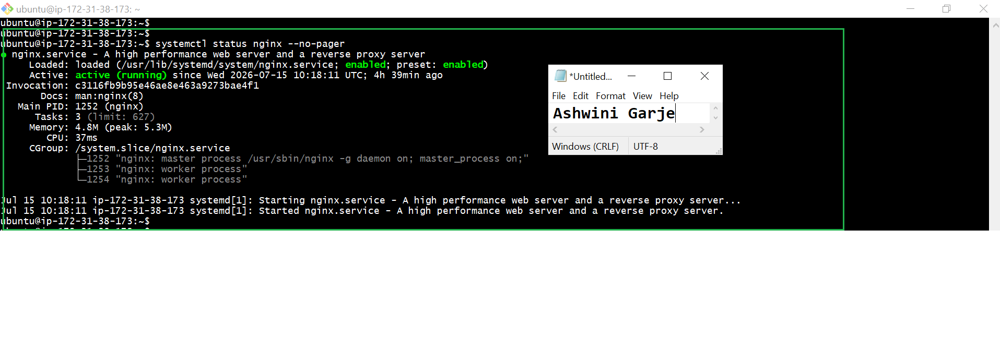

---

#### Screenshot 2 — Output of `sudo nginx -t`

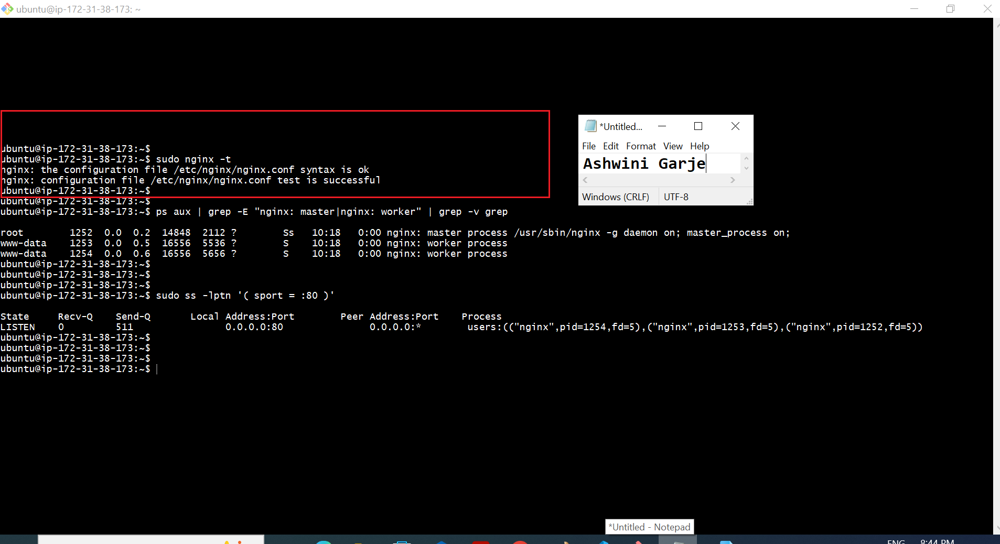
---

#### Screenshot 3 — Output of `sudo ss -lptn '( sport = :80 )'`

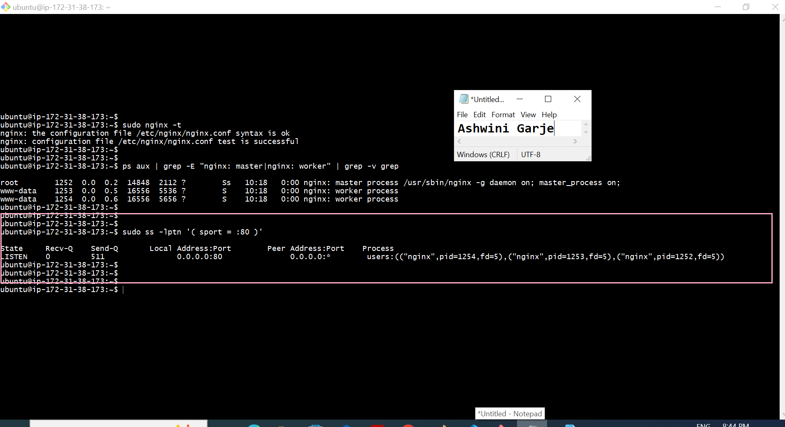
---

### Notes

Answer the following in your own words:

**1. What happens if Nginx fails to restart in production?**

If Nginx fails to restart the website is not working and users cannot access it.New configuration changes will not be applied.Check the Nginx configuration using sudo nginx -t, fix the errors,also check logs and restart the service.

---

**2. What's your basic rollback plan?**

If something goes wrong i will restore the previous working all configuration or backup.
Then i will restart Nginx and check if the website is working properly than i will test the application to make sure everything is running normally.

---

# Task 3 — Logs & Request Trace

## Goal

Verify real traffic flow and analyze logs to understand system behavior and errors.

### Evidence

#### Screenshot 1 — Output of `sudo tail -n 30 /var/log/nginx/access.log`

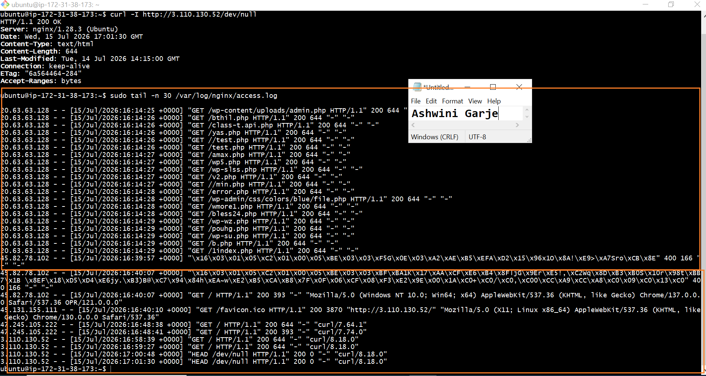

---

#### Screenshot 2 — Output of `sudo tail -n 30 /var/log/nginx/error.log`

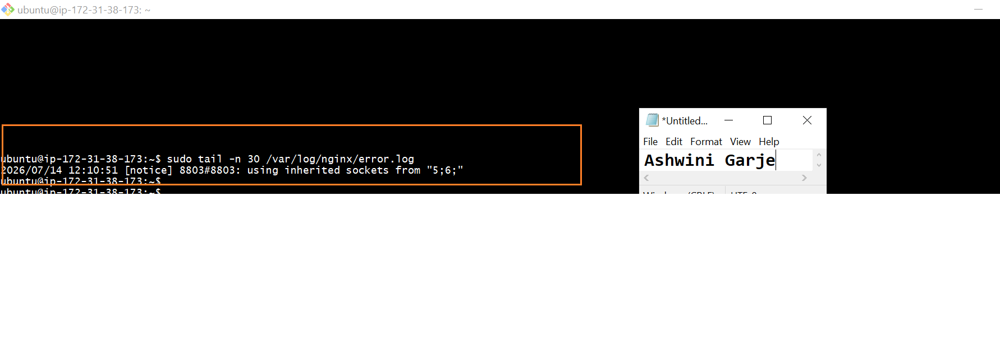

---

#### Screenshot 3 — Output of `sudo journalctl -u nginx --no-pager -n 50`

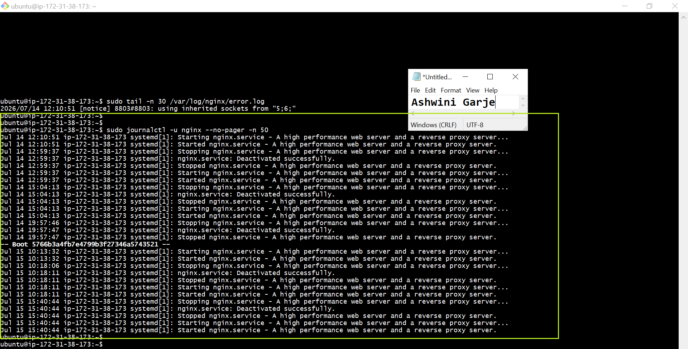

---

### Notes

Answer the following in your own words:

**1. Were there any errors in the logs?**

- If yes, mention 1–2 example error lines from the logs and explain what each one means in simple terms.
- If no, explain what it means if the error log is empty or shows no recent errors during your check.

I check the Nginx error log in file and found no error messages.The log only showed a notice: using inherited sockets from "5;6;" which is a normal message during an Nginx restart or reload This means Nginx is running correctly and no recent errors were found.

---

**2. If there were no errors, what does that indicate about the system?**

I did not find any errors in the Nginx error log.The log only shows a normal [notice] message, this is not an error.This indicates that Nginx is running properly and the web server is working without any recent issues.

---

**3. Based on the access logs, were your curl requests visible in the log entries? What does that prove about traffic flow?**

Yes, my curl requests were recorded in the Nginx access log file. The log shows is 200 OK status, which means the server received and processed the request successfully.This proves that traffic is reaching the server correctly.

---

# Task 4 — System Resource Health Check (Capacity Red Flags)

## Goal

Assess server capacity and detect potential performance or failure risks.

### Evidence

#### Screenshot 1 — Output of `uptime`

---

#### Screenshot 2 — Output of `free -h`

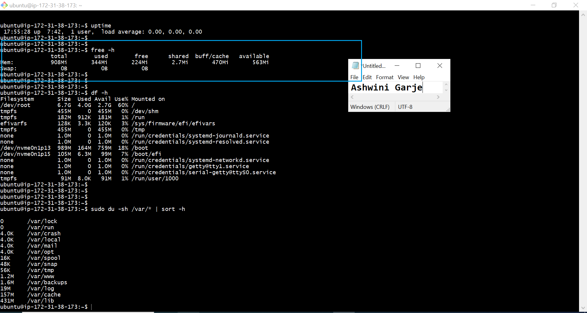
---

#### Screenshot 3 — Output of `df -h`

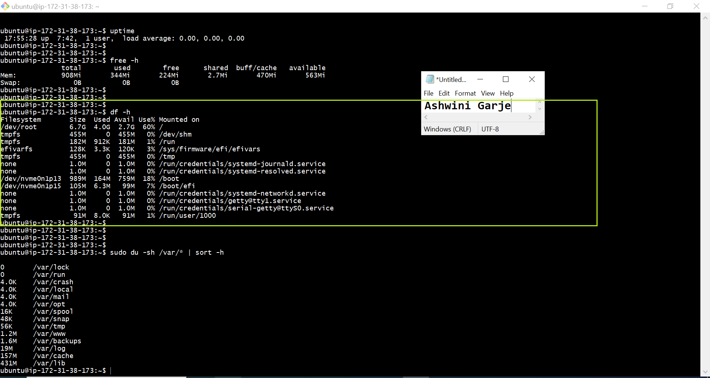
---

#### Screenshot 4 — Output of `sudo du -sh /var/* | sort -h`

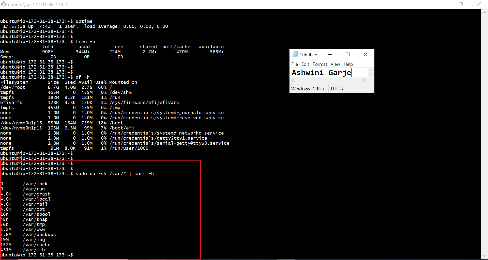
---

### Notes

Answer the following in your own words:

**1. Which resource looks most critical right now? (CPU/load, memory, or disk) Explain why.**

The disk usage looks the most important right now It is using 60% of the available storage, which is higher than CPU and memory usage. it is not critical yet, it should be monitored to prevent the disk from becoming full in the future.

disk - /dev/root  6.7G  4.0G  2.7G  60% /  =>  60% -available storage
memory- 344 MiB / 908 MiB- Enough free memory available
CPU Load- load average: 0.00, 0.00, 0.00

---

**2. What happens if disk becomes 100% full in a production server?**

If the disk usage reaches 100% full the server may stop working properly. New files, logs, and application data cannot be saved, and some services may fail or crash. This can cause downtime until enough disk space is freed.

---

# Task 5 — Configuration & Deployment Verification

## Goal

Ensure the correct React build is deployed and Nginx is serving it properly.

### Evidence

#### Screenshot 1 — Output of `ls -lah /var/www/html | head -n 20`

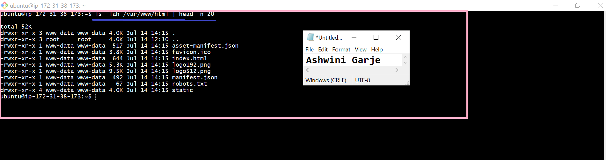
---
---

#### Screenshot 2 — Output of `grep -R "Deployed by" -n /var/www/html 2>/dev/null | head`

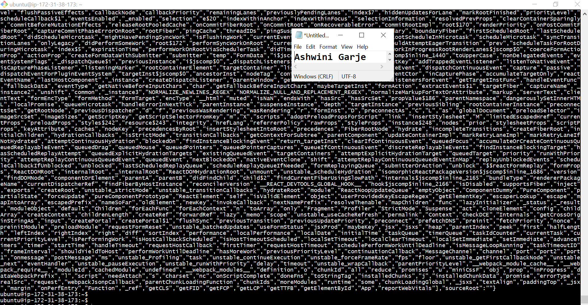
---
---

#### Screenshot 3 — Output of `grep -n "try_files" /etc/nginx/sites-available/default`

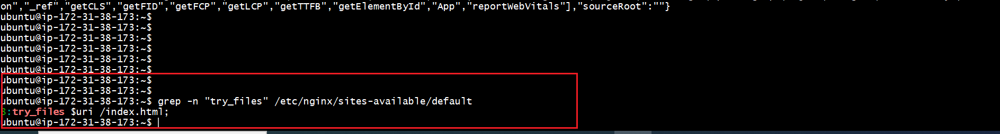
---
---

### Notes

Answer the following in your own words:

**1. How do you confirm that the correct version of the application is deployed?**

I checked the files in /var/www/html using the ls -lah command and confirmed that the React build files, such as index.html and the static folder, were present. Then I verified that my changes were included in the build using the grep command. Finally, I opened the application using the EC2 public IP in the browser and confirmed that the latest version of the React app was loading correctly through Nginx.

---

# Task 6 — Nginx Configuration Failure Simulation

## Goal

Simulate a real-world Nginx misconfiguration and recover the service safely.

### Evidence

#### Screenshot 1 — Output of `sudo nginx -t` showing the syntax error (broken config)

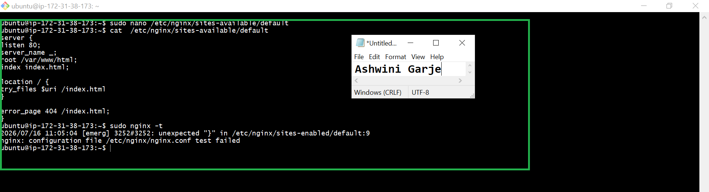

---

#### Screenshot 2 — Output of `sudo nginx -t` showing syntax ok (fixed config)

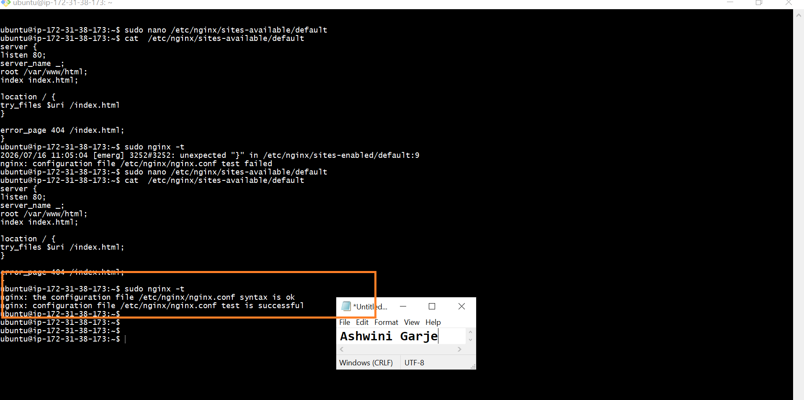

---

#### Screenshot 3 — Output of `curl -I http://<public-ip>` confirming recovery (200 OK)

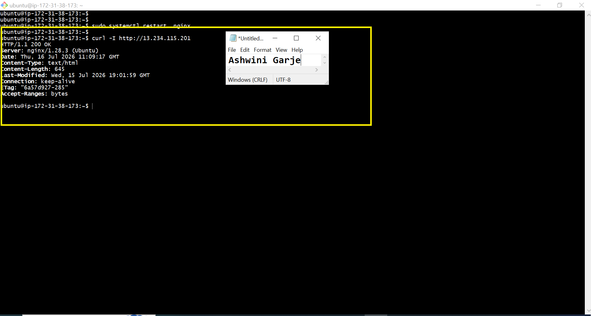

---

### Notes

Answer the following in your own words:

**1. What caused the configuration failure?**

The configuration failed because there was a syntax error in the Nginx configuration file(/etc/nginx/sies-avaibale/defualt). A missing ; or } caused nginx -t to fail. After fixing the configuration file, the test passed and Nginx started working correctly.

---

**2. How did you fix the issue?**

I checked the Nginx configuration (/etc/nginx/sies-avaibale/defualt) using sudo nginx -t and found the syntax error. I fixed the missing ; in the configuration file, saved the changes, and tested the configuration again. After the test passed, I restarted Nginx successfully.

---

**3. How can you avoid this kind of issue in real production systems?**

To avoid this issue in production, always test the application before deployment. Check the configuration with sudo nginx -t, verify that the latest build files are deployed, and test the website after deployment to make sure everything is working correctly.

---

# Task 7 — Web Application Failure Simulation

## Goal

Simulate missing deployment content and recover the application safely.

### Evidence

#### Screenshot 1 — Output of `curl -I http://<public-ip>` showing failure (non-200 response)

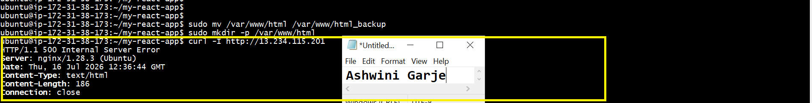
---

#### Screenshot 2 — Output of `curl -I http://<public-ip>` confirming recovery (200 OK)

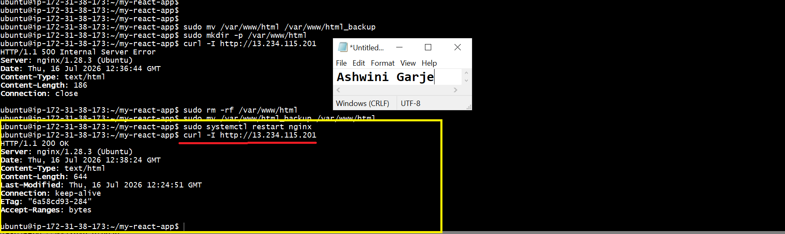

---

### Notes

Answer the following in your own words:

**1. What caused the application to break in this scenario?**

The application stopped working because the files inside the /var/www/html folder were removed and replaced with an empty directory. Since important files like index.html were missing, Nginx could not load the React application, so the website became unavailable.

---

**2. How did you fix the issue and restore the application?**

I restored the original deployment by removing the empty  files from /var/www/html directory and moving the backup directory back to this diretire /var/www/html. After that I restarted the Nginx service nad confim the recovery by sending a request to the application public IP The server returned a successful HTTP 200 response than confirming application it was working properly.

---

**3. What steps would you take to prevent this kind of issue in real production systems?**

I will keep a backup of the /var/www/html directory before making any changes. I will test the deployment in a development environment first, verify the Nginx configuration, and check that the website is working properly after every deployment.

---

# Task 8 — Security & Reliability Review

## Goal

Review and reflect on the security and reliability practices applied during this assignment.

### Security & Reliability Notes

Answer the following in your own words:

**1. Why is SSH key-based authentication more secure than sharing passwords?**

SSH key-based authentication is more secure because it uses a private and public key instead of a password. The private key stays only with the user and is difficult to guess or steal, which makes it much safer than sharing passwords.

---

**2. Why should only required ports be open on a production server?**

Only the ports that are needed should be open. This keeps the server safe and reduces the chance of hackers getting access.

---

**3. Why is it important for Nginx to be enabled on boot?**
Nginx should be enabled on boot so it starts automatically when the server restarts. This keeps the website available without needing to start Nginx manually.

---

**4. What are the risks of sharing secrets, keys, or credentials publicly?**

Sharing secrets, keys, or passwords publicly is dangerous because anyone can use them to access your server or account. This can lead to data loss, security problems, or unauthorized changes.

---

**5. Why should cloud resources be stopped or terminated when they are no longer needed?**

Cloud resources should be stopped or terminated when they are not needed to avoid extra costs. It also helps save resources and keeps the cloud environment clean.

---

# LinkedIn Post (Required)

## Evidence

#### LinkedIn Post URL

Paste your LinkedIn post URL here:

`__________________________`

---

#### Screenshot — Published LinkedIn post

Add your screenshot here.

---

# Submission Instructions

- Add all required screenshots in your submission
- Full name must be visible in required screenshots
- Do not expose sensitive information (keys, passwords, account IDs)

---

# Completion Checklist

- ✅ Task 1: Screenshots (browser, ip a, ss -tulpen, ufw status) + Notes answered
- ✅ Task 2: Screenshots (nginx status, nginx -t, ss port 80) + Notes answered
- ✅ Task 3: Screenshots (access log, error log, journalctl) + Notes answered
- ✅ Task 4: Screenshots (uptime, free -h, df -h, du -sh) + Notes answered
- ✅ Task 5: Screenshots (ls html, grep deployed by, grep try_files) + Notes answered
- ✅ Task 6: Screenshots (nginx -t fail, nginx -t pass, curl recovery) + Notes answered
- ✅ Task 7: Screenshots (curl failure, curl recovery) + Notes answered
- ✅ Task 8: Security & Reliability Notes answered
- ✅ LinkedIn post published and URL submitted
- ✅ Full Name visible in all required screenshots
- ✅ No sensitive data exposed

---

## 📌 About DMI & CloudAdvisory

DevOps Micro Internship (DMI) is a project-based DevOps program run by Pravin Mishra (The CloudAdvisory) focused on real-world execution, systems thinking, and career readiness.

It helps learners build strong DevOps foundations with hands-on experience.

---

## 📌 Resources

- 🌐 DMI Official Website: https://pravinmishra.com/dmi  
- 🎓 DevOps for Beginners (Udemy): https://www.udemy.com/course/devops-for-beginners-docker-k8s-cloud-cicd-4-projects/  
- 🎓 Agentic AI DevOps with Claude Code: https://www.udemy.com/course/ultimate-agentic-ai-devops-with-claude-code/  
- 🎓 DevOps with Claude Code: Terraform, EKS, ArgoCD & Helm: https://www.udemy.com/course/devops-with-claude-code-terraform-eks-argocd-helm/  
- ▶️ YouTube Playlist: https://www.youtube.com/playlist?list=PLFeSNDtI4Cho  
- 🔗 Pravin Mishra (LinkedIn): https://www.linkedin.com/in/pravin-mishra-aws-trainer/  
- 🏢 CloudAdvisory (LinkedIn): https://www.linkedin.com/company/thecloudadvisory/

---

*This submission is part of DevOps Micro Internship (DMI) Cohort 3 — Agentic AI Track.*